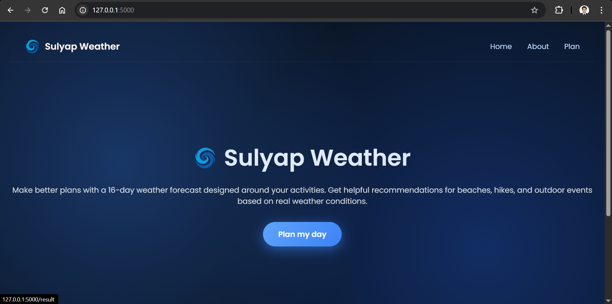
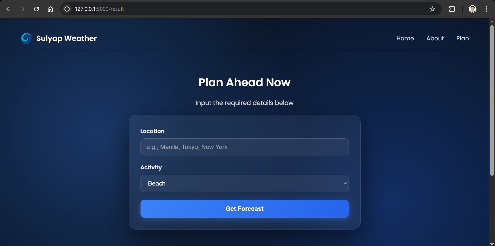
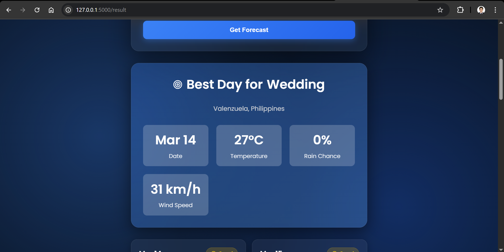
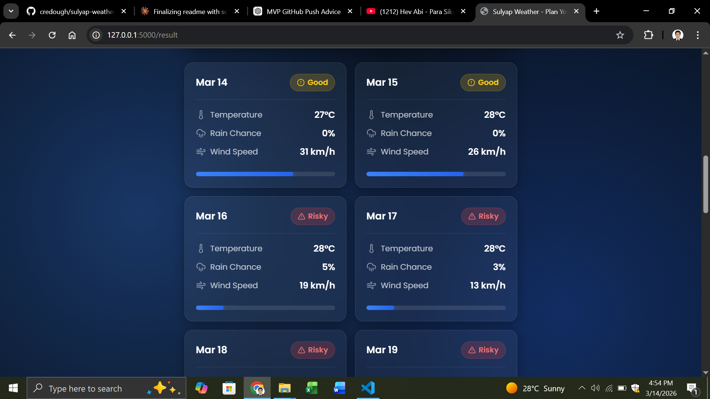

<div align="center">

  <h1>
    
    Sulyap-weather
  </h1>

  <p><em><strong>Sulyap</strong> (Filipino, n.) — a quick glance, a glimpse.</em></p>

  <!-- Badges -->
  <p>
    
    
    
    
  </p>
</div>

---

A Flask-based weather intelligence API that fetches real-time 16-day forecasts and scores each day based on user-selected activities — **Beach**, **Hiking**, or **Wedding**. Designed API-first, so any frontend (HTML/JS, React, mobile) can plug right in.

---

## Screenshots

> *Screenshots below reflect the MVP frontend.*

### Main Interface


### Input Fields


### Forecast Results — Beach Activity


### Top Pick Highlight


### 16-Day Forecast


---

## Project Architecture

```
Sulyap-weather/
│
├── app/
│   ├── __init__.py      # Flask app factory
│   ├── routes.py        # API routes
│   ├── utils.py         # Weather, geocoding, and scoring logic
│   ├── static/          # Frontend assets
│   └── templates/       # HTML templates
│
├── config.py            # App configuration
├── run.py               # App entry point
├── requirements.txt     # Python dependencies
└── README.md
```

This structure follows Flask best practices — routing logic is kept separate from business logic.

---

## How It Works

### 1. User Input
The user provides:
- **Location** — e.g., `Boracay`, `Mt. Pulag`
- **Activity** — `Beach`, `Hiking`, or `Wedding`

### 2. Geocoding
The location name is converted to latitude/longitude using the **Open-Meteo Geocoding API**.

### 3. Weather Forecast
A **16-day forecast** is fetched from the **Open-Meteo Forecast API**, returning:
- Max temperature (°C)
- Rain probability (%)
- Wind speed (km/h)

### 4. Scoring Engine
Each day receives a score from **0 to 100** based on the selected activity.

**Example — Beach scoring:**
| Condition | Score Impact |
|---|---|
| Temperature > 28°C | +40 |
| Rain probability > 20% | −50 |
| Wind speed > 15 km/h | −20 |

### 5. Result Selection
The highest-scoring day is flagged as the **Top Pick**. Every day also receives a badge:

| Badge | Score Range |
|---|---|
| 🟢 Perfect | 90–100 |
| 🟡 Good | 70–89 |
| 🔴 Risky | < 70 |

### 6. Response
A structured JSON response is returned containing location details, the top pick, and the full 16-day forecast with scores and badges.

---

## API Endpoint

```
GET /api/sulyap
```

### Query Parameters

| Parameter | Required | Description |
|---|---|---|
| `location` | ✅ Yes | Location name (e.g., `Boracay`) |
| `activity` | ❌ No | `Beach` \| `Hiking` \| `Wedding` (default: `Beach`) |

### Example Request

```
GET /api/sulyap?location=Boracay&activity=Beach
```

### Example Response

```json
{
  "location": {
    "name": "Boracay",
    "lat": 11.967,
    "lon": 121.924
  },
  "activity": "Beach",
  "top_pick": {
    "date": "2026-01-10",
    "score": 95,
    "badge": "🟢 Perfect"
  },
  "forecast": [
    {
      "date": "2026-01-09",
      "temp": 29,
      "rain": 10,
      "wind": 12,
      "score": 88,
      "badge": "🟡 Good"
    }
  ]
}
```

---

## Getting Started

### Prerequisites
- Python 3.9+
- pip

### Installation

```bash
git clone https://github.com/credough/sulyap-weather.git
cd sulyap-weather
pip install -r requirements.txt
python run.py
```

The API will be available at `http://localhost:5000`.

---

## Design Decisions

**No database** — The app focuses entirely on real-time data; there's nothing to persist.

**Separation of concerns** — `routes.py` handles HTTP, `utils.py` owns all logic and external API calls.

**API-first** — The frontend and backend are loosely coupled, so any UI layer can consume the API independently.

**Scalable by design** — Adding new activities, tweaking scoring rules, or swapping the weather provider requires changes in one place (`utils.py`).

---

## Roadmap

- [ ] Add more activities (Camping, Festival, Photography)
- [ ] Support hourly forecasts
- [ ] Caching layer to reduce API calls
- [ ] Frontend polish (React or mobile app)
- [ ] Unit tests for the scoring engine

---

## Tech Stack

| Layer | Technology |
|---|---|
| Backend | Python, Flask |
| Geocoding | Open-Meteo Geocoding API |
| Weather Data | Open-Meteo Forecast API |
| Response Format | JSON |

---

## License

MIT — free to use and modify.